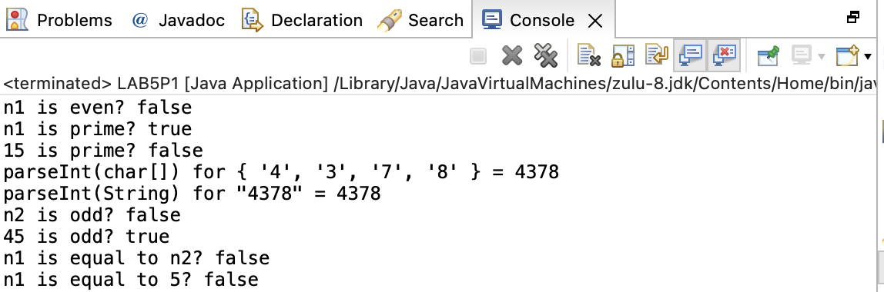
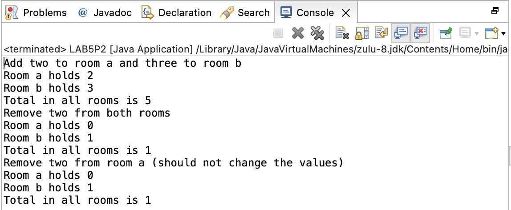

[toc]

# Lab 5 Assignment 2 Document Henan Mu

Name: Henan Mu

## Problem 1  MyInteger

### Problem description

Design our own Integer-like wrapper class. It should include some data fields and methods to make it like a real Integer class.

We need to build methods isEven(), isOdd(), and isPrime() to do some verification on the value. We will implement methods equals(int) and equals(MyInteger) to do equal, and methods parseInt(char[]) and parseInt(String) to convert an array of numeric characters or a string into an int value.

```
The class contains:
• An int data field named value that stores the int value represented by this object.
• A constructor that creates a MyInteger object for the specified int value.
• A getter method that returns the int value.
• The methods isEven(), isOdd(), and isPrime() that return true if the value in this object is even, odd, or prime, respectively.
• The static methods isEven(int), isOdd(int), and isPrime(int) that return true if the specified value is even, odd, or prime, respectively.
• The static methods isEven(MyInteger), isOdd(MyInteger), and isPrime(MyInteger) that return true if the specified value is even, odd, or prime, respectively.
• The methods equals(int) and equals(MyInteger) that return true if the value in this object is equal to the specified value.
• A static method parseInt(char[]) that converts an array of numeric characters to an int value.
• A static method parseInt(String) that converts a string into an int value. 
```

Be careful about static, parameter and some other details.

### Analysis:

First of all, we need an int data field named value that stores the int value represented by this object. 

```java
int value;
```

We build a constructor to have creates a MyInteger object for the specified int value. In this method, we assign the value to the specified int value.

```java
	public MyInteger(int value) {
		// TODO: write your code here
		this.value = value;
	}
```

 A getter method that returns the int value,  `return value;`

For isEven() and isOdd(), we use mod 2. If the reminder is 1, the value is odd, otherwise, the value is even.

```java
	public boolean isEven() {
		// TODO: write your code here
		return (value % 2 == 0);
	}

	public boolean isOdd() {
		// TODO: write your code here
		return (value % 2 == 1);
	}
```

For isPrime(), a *prime number* (or a prime) is a natural number greater than 1 that is not a product of two smaller natural numbers. If the number is less than 2, it's not a prime number. If the number is 2, it's a prime number. If the number is greater than 2, we verify whether the number is divisible by a number which is greater than 1 and less than the number. If no, the number is not a prime number, otherwise, it is a prime number.

```java
	public boolean isPrime() {
		// TODO: write your code here
		if (value < 2) return false;
		if (value == 2) return true;
		if (value > 2) {
			for (int i = 2; i < value; i++) {
				if (value % i == 0) return false;
			}
		}
		return true;
	}
```

For static methods isEven(int), isOdd(int), and isPrime(int), they are same like methods isEven(), isOdd(), and isPrime(). We just need to change the value to the passed int number.

```java
	public static boolean isEven(int n) {
		// TODO: write your code here
		return (n % 2 == 0);
	}

	public static boolean isOdd(int n) {
		// TODO: write your code here
		return (n % 2 == 1);
	}
	public static boolean isPrime(int num) {
		// TODO: write your code here
		if (num < 2) return false;
		if (num == 2) return true;
		if (num > 2) {
			for (int i = 2; i < num; i++) {
				if (num % i == 0) return false;
			}
		}
		return true;
	}
```

For the static methods isEven(MyInteger), isOdd(MyInteger), and isPrime(MyInteger), they are same like methods isEven(), isOdd(), and isPrime(). We just need to change the value to the `o.getValue()`.

```java
	public static boolean isEven(MyInteger n) {
		// TODO: write your code here
		return (n.getValue() % 2 == 0);
	}

	public static boolean isOdd(MyInteger n) {
		// TODO: write your code here
		return (n.getValue() % 2 == 1);
	}
	public static boolean isPrime(MyInteger o) {
		// TODO: write your code here
		int value = o.getValue();
		if (value < 2) return false;
		if (value == 2) return true;
		if (value > 2) {
			for (int i = 2; i < value; i++) {
				if (value % i == 0) return false;
			}
		}
		return true;
	}
```

The methods equals(int) and equals(MyInteger) that return true if the value in this object is equal to the specified value.

For equals(int), we compare value and the passed int number.

```java
	public boolean equals(int anotherNum) {
		// TODO: write your code here
		return (value == anotherNum);
	}
```

For equals(MyInteger), firstly, we need to verify the type, If the type of the parameter is not MyInteger, we return false. If the type of the parameter is MyInteger, we compare the value with `o.getValue()`

```java
	public boolean equals(MyInteger o) {
		// TODO: write your code here
		if (o instanceof MyInteger) {
			return (value == o.getValue());
		}
		return false;
	}
```

A static method parseInt(char[]) that converts an array of numeric characters to an int value.

For parseInt(char[]), firstly, we assign the result to 0 `int result = 0`. Then we traverse the elements in the char array from index of 0. For each element, before we use it, we multiply the result by 10, we convert the element to a int number and plus it to the result.

```java
	public static int parseInt(char[] numbers) {
		// numbers consists of digit characters.
		// For example, if numbers is {'1', '2', '5'}, the return value
		// should be 125. Please note that
		// numbers[0] is '1'
		// numbers[1] is '2'
		// numbers[2] is '5'

		// TODO: write your code here
		
		int result = 0;
		for (int i = 0; i < numbers.length; i++) {
			result *= 10;
			result += numbers[i] - '0';
		}
		return result;
	}
```

A static method parseInt(String) that converts a string into an int value. 

For that method, we use `toCharArray()` to convert the String to a char array, and then we use parseInt(char[]).

```java
	public static int parseInt(String s) {
		// s consists of digit characters.
		// For example, if s is "125", the return value
		// should be 125.
		
		// TODO: write your code here
		char[] charArr = s.toCharArray();
		return parseInt(charArr);
	}
```


### Source code:

```java
package edu.northeastern.csye6200;


public class LAB5P1 {
	public static void main(String[] args) {
		// TODO: write your code here
		MyInteger n1 = new MyInteger(7);
		System.out.println("n1 is even? " + n1.isEven());
		System.out.println("n1 is prime? " + n1.isPrime());
		System.out.println("15 is prime? " + MyInteger.isPrime(15));
		System.out.println("parseInt(char[]) for { '4', '3', '7', '8' } = " + MyInteger.parseInt(new char[]{'4', '3', '7', '8'}));
		System.out.println("parseInt(String) for \"4378\" = " + MyInteger.parseInt("4378"));
		
		MyInteger n2 = new MyInteger(24);
		System.out.println("n2 is odd? " + n2.isOdd());
		System.out.println("45 is odd? " + MyInteger.isOdd(45));
		System.out.println("n1 is equal to n2? " + n1.equals(n2));
		System.out.println("n1 is equal to 5? " + n1.equals(5));
		
		
	}
}

class MyInteger {
	
	// TODO: write your code here
	int value;
	
	public int getValue() {
		// TODO: write your code here
		return value;
	}

	public MyInteger(int value) {
		// TODO: write your code here
		this.value = value;
	}

	public boolean isPrime() {
		// TODO: write your code here
		if (value < 2) return false;
		if (value == 2) return true;
		if (value > 2) {
			for (int i = 2; i < value; i++) {
				if (value % i == 0) return false;
			}
		}
		return true;
	}

	public static boolean isPrime(int num) {
		// TODO: write your code here
		if (num < 2) return false;
		if (num == 2) return true;
		if (num > 2) {
			for (int i = 2; i < num; i++) {
				if (num % i == 0) return false;
			}
		}
		return true;
	}

	public static boolean isPrime(MyInteger o) {
		// TODO: write your code here
		int value = o.getValue();
		if (value < 2) return false;
		if (value == 2) return true;
		if (value > 2) {
			for (int i = 2; i < value; i++) {
				if (value % i == 0) return false;
			}
		}
		return true;
	}

	public boolean isEven() {
		// TODO: write your code here
		return (value % 2 == 0);
	}

	public boolean isOdd() {
		// TODO: write your code here
		return (value % 2 == 1);
	}

	public static boolean isEven(int n) {
		// TODO: write your code here
		return (n % 2 == 0);
	}

	public static boolean isOdd(int n) {
		// TODO: write your code here
		return (n % 2 == 1);
	}

	public static boolean isEven(MyInteger n) {
		// TODO: write your code here
		return (n.getValue() % 2 == 0);
	}

	public static boolean isOdd(MyInteger n) {
		// TODO: write your code here
		return (n.getValue() % 2 == 1);
	}

	public boolean equals(int anotherNum) {
		// TODO: write your code here
		return (value == anotherNum);
	}

	public boolean equals(MyInteger o) {
		// TODO: write your code here
		if (o instanceof MyInteger) {
			return (value == o.getValue());
		}
		return false;
	}

	public static int parseInt(char[] numbers) {
		// numbers consists of digit characters.
		// For example, if numbers is {'1', '2', '5'}, the return value
		// should be 125. Please note that
		// numbers[0] is '1'
		// numbers[1] is '2'
		// numbers[2] is '5'

		// TODO: write your code here
		
		int result = 0;
		for (int i = 0; i < numbers.length; i++) {
			result *= 10;
			result += numbers[i] - '0';
		}
		return result;
	}

	public static int parseInt(String s) {
		// s consists of digit characters.
		// For example, if s is "125", the return value
		// should be 125.
		
		// TODO: write your code here
		char[] charArr = s.toCharArray();
		return parseInt(charArr);
	}
}
```


### Screenshots of sample runs:




***

## Problem 2 RoomPeople

### Problem description

We need to create a class RoomPeople that can be used to record the number of people in the rooms of a building. 

```
The class has the attributes:
• numberInRoom - the number of people in a room
• totalNumber - the total number of people in all rooms as a static variable 
```

The RoomPeople record the number of people in a specific room and the total number of people in all rooms. Apart from that, we need to implement some methods to get number of change the number.

```
The class has the following methods:
• addOneToRoom - adds a person to the room and increases the value of totalNumber
• removeOneFromRoom - removes a person from the room, ensuring that numberInRoom does not go
below zero, and decreases the value of totalNumber as needed
• getNumber - returns the number of people in the room
• getTotal - a static method that returns the total number of people 
```

We'll use static for total number of people.

### Analysis:

First of all, we need two data fields numberInRoom and totalNumber.

```java
int numberInRoom;
static int totalNumber;
```

In constructor, we assign 0 to numberInRoom.

```java
    public RoomPeople() {
    	// TODO: write your code here
    	numberInRoom = 0;
    }
```

For getNumber and getTotal, we return totalNumber or numberInRoom.

```java
    public static int getTotal(){
    	// TODO: write your code here
    	return totalNumber;
    }
    public int getNumber(){
    	// TODO: write your code here
        return numberInRoom;
    }
```

For addOneToRoom, we plus 1 to numberInRoom and totalNumber.

```java
    public void addOneToRoom(){
    	// TODO: write your code here
    	numberInRoom++;
    	totalNumber++;
    }
```

For removeOneFromRoom, we need to check the numberInRoom. If it's 0, we do nothing, otherwise, we decrease numberInRoom and totalNumber by 1.

```java
    public void removeOneFromRoom(){
    	// TODO: write your code here
    	if (numberInRoom == 0) return;
    	numberInRoom--;
    	totalNumber--;
    }
```


### Source code:

```java
package edu.northeastern.csye6200;

public class LAB5P2 {
	public static void main(String[] args){
		// TODO: write your code here
		System.out.println("Add two to room a and three to room b");
		RoomPeople roomA = new RoomPeople();
		roomA.addOneToRoom();
		roomA.addOneToRoom();
		
		RoomPeople roomB = new RoomPeople();
		roomB.addOneToRoom();
		roomB.addOneToRoom();
		roomB.addOneToRoom();
		
		System.out.println("Room a holds " + roomA.getNumber());
		System.out.println("Room b holds " + roomB.getNumber());
		System.out.println("Total in all rooms is " + RoomPeople.getTotal());
		
		System.out.println("Remove two from both rooms");
		
		roomA.removeOneFromRoom();
		roomA.removeOneFromRoom();
		roomB.removeOneFromRoom();
		roomB.removeOneFromRoom();
		
		System.out.println("Room a holds " + roomA.getNumber());
		System.out.println("Room b holds " + roomB.getNumber());
		System.out.println("Total in all rooms is " + RoomPeople.getTotal());
		
		System.out.println("Remove two from room a (should not change the values)");

		System.out.println("Room a holds " + roomA.getNumber());
		System.out.println("Room b holds " + roomB.getNumber());
		System.out.println("Total in all rooms is " + RoomPeople.getTotal());
	}
}

class RoomPeople {
    
	// TODO: write your code here
    int numberInRoom;
    static int totalNumber;
	
    public static int getTotal(){
    	// TODO: write your code here
    	return totalNumber;
    }
    
    public RoomPeople() {
    	// TODO: write your code here
    	numberInRoom = 0;
    }
    
    public void addOneToRoom(){
    	// TODO: write your code here
    	numberInRoom++;
    	totalNumber++;
    }
    
    public void removeOneFromRoom(){
    	// TODO: write your code here
    	if (numberInRoom == 0) return;
    	numberInRoom--;
    	totalNumber--;
    }
    
    public int getNumber(){
    	// TODO: write your code here
        return numberInRoom;
    }
}   

```


### Screenshots of sample runs:

